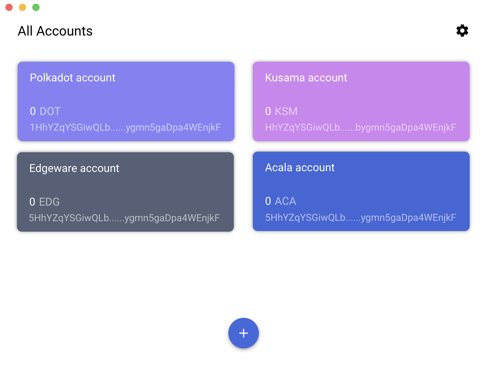

# [Sakura Wallet](https://www.dotpay.tech/)

Sakura is a Desktop wallet for the Polkadot ecosystem.
<p align="left">
  <a href="https://github.com/w3finance/sakura/releases">
    
  </a>
</p>

### Development

To clone and run this repo you'll need [Node.js](https://nodejs.org/en/) and [Yarn](https://yarnpkg.com/) installed on your computer.

```bash
git clone https://github.com/w3finance/sakura.git
cd sakura
yarn
```

Then you can run:

```bash
yarn dev
```

You will see the app in development mode with electron.

### DevTools

Toggle DevTools:

* OSX: <kbd>Cmd</kbd> <kbd>Alt</kbd> <kbd>I</kbd> or <kbd>F12</kbd>
* Linux: <kbd>Ctrl</kbd> <kbd>Shift</kbd> <kbd>I</kbd> or <kbd>F12</kbd>
* Windows: <kbd>Ctrl</kbd> <kbd>Shift</kbd> <kbd>I</kbd> or <kbd>F12</kbd>

### Production build.

Create a package for OSX, Windows and Linux.

```bash
yarn dist
```

### Working prototype
You can find our working prototype through the [link](https://free.modao.cc/app/e28c820ad8f37333312fef08577f87e9bb94ace4?simulator_type=device&sticky).


### License
GPL v3.
